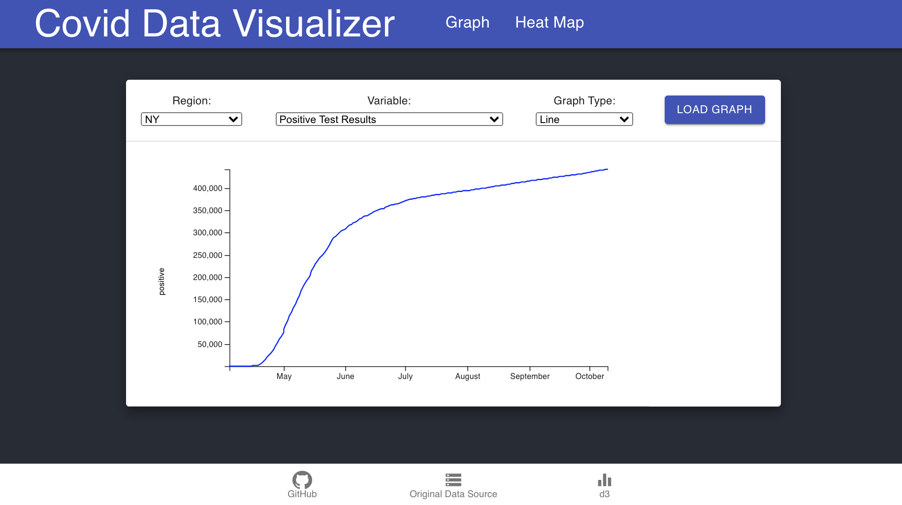
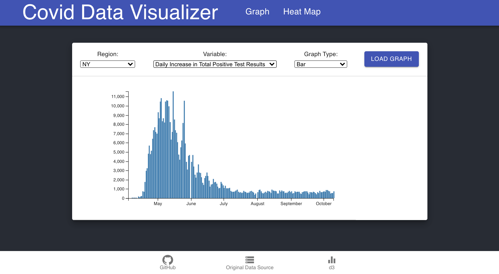

# Covid-19 Visualizer

## Learning D3 in 4 Days


Throughout the past 6 months, I've spent countless hours pouring over COVID-19 data. From line graphs representing positive cases in New York City, to animated maps demonstrating how hot spots have progressively migrated across the U.S, I have seen my fair share of informative and not so informative visuals with varying levels of complexity.

So when tasked with self-teaching a new tool for the Grace Hopper Stackathon, it felt like a natural first choice to see if I could learn to make a few Covid-19 graphs myself.

---

## Tech-Stack:

This app was built using Creat-React-App. Below is a list of additional technologies:

| React | React Router Dom |
| D3 | D3-queue |
| TopoJSON | GeoJSON |
| Material UI | Material UI Icons |


---

## How to use this app:

You explore the data visualization tools at https://data-visualizer-abw.herokuapp.com/

Or, feel free to clone repo. To start, please enter the following commands on your terminal:

```shell
git clone https://github.com/arielwainer4/dataVisualizer.git
cd CovidData/my-app
npm install
npm start
This app will run at http://localhost:3000/
```

---

## Current Features:

Heat Map:
The heat map displays the most up to date distribution of positive Covid-19 tests across the United States, organized by color.


Graphs:
To view the data, select a region (U.S. or state-specific), a variable, and graph format.

Line Graph


Bar Graph


---

## About The Author:
This app was born as a bootcamp challenge to learn a new technology over the course of 4 days. My goal was to combine a practical skillset (D3) with information I found intriguing (Covid-19 tracking).

Feel free to reach out if you'd like learn more about this project or my experience!

Ariel Wainer | [arielwainer4](https://github.com/arielwainer4) | [/in/arielwainer/](https://www.linkedin.com/in/arielwainer/) 

